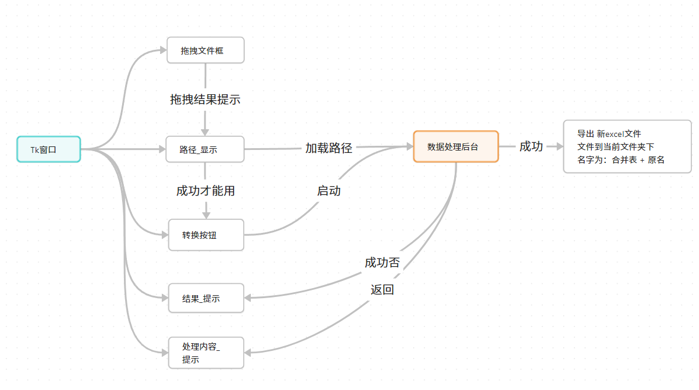

## excel_tool
用于 excel子表数据合并的脚本软件

### 框架思路

### 打包方法

打包exe: `pyinstaller --onefile --noconsole --icon=your_icon.ico your_script.py`

### 环境版本

python  为 3.8.3

- pandas ==1.3.5
- tkinterdnd2 ==1.2.1
- pyinstaller ==4.1
